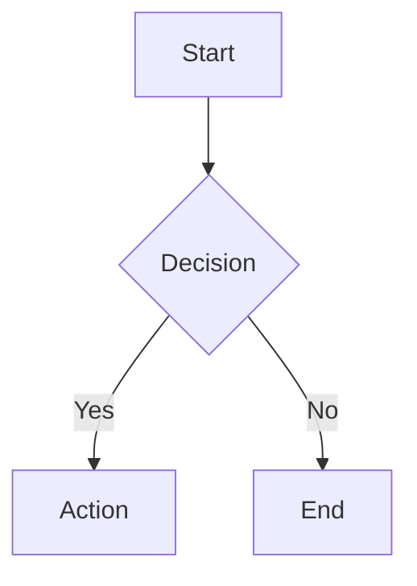

# Authoring — API

## Using Components in Markdown

Wrap YAML data in a code fence using the component name as the language:

````markdown
```entity-schema
name: "User"
fields:
  - name: "id"
    type: "string"
    required: true
    description: "Unique identifier"
  - name: "email"
    type: "string"
    required: true
    description: "User email address"
```
````

The component-renderer plugin detects the fence, parses the YAML, and calls the matching component function.

### Available code fence components

| Fence Name | Component | Notes |
|-----------|-----------|-------|
| `entity-schema` | EntitySchema | Object with `name` + `fields` |
| `api-endpoint` | ApiEndpoint | Object with `method` + `path` |
| `status-flow` | StatusFlow | Object with `states` array |
| `directive-table` | DirectiveTable | Object with `categories` |
| `step-type` | StepType | Object with `name` + `category` |
| `config-example` | ConfigExample | Object with `code` + `annotations` |
| `card-grid` | CardGrid | **Array** at top level (unique!) |
| `side-by-side` | SideBySide | Object with `left` + `right` |

See `references/components/api.md` for full YAML schemas.

## Mermaid Diagrams

Standard mermaid fences work — NOT a registered component, processed by Mermaid library directly:

````markdown

````

Rendered in `doneEach` hook after DOM update.

## Region Toggles

Use `data-region` HTML attributes for togglable content sections:

```html
<div data-region="us">
  US-specific content here.
</div>

<div data-region="eu">
  EU-specific content here.
</div>
```

The `processRegionDirectives()` function (from region-toggle.js) groups these by heading level and creates a tab interface. Processed in `doneEach`.

## Inline Code Blocks

Use the `CodeBlock` utility (not a registry component) for inline highlighted code:

```javascript
// In a component's template literal:
${window.CodeBlock({ language: 'json', code: '{"key": "value"}' })}
```

Primarily used inside other components, not directly in markdown.

## Markdown Features (Docsify)

Standard markdown plus Docsify extensions:

```markdown
<!-- Hints/alerts -->
> [!NOTE]
> This is a note.

> [!TIP]
> Helpful tip here.

> [!WARNING]
> Be careful about this.

<!-- Embed another markdown file -->
[filename](content/other-page.md ':include')

<!-- Image with caption -->

```

## See Also

- `references/components/api.md` — complete YAML schemas for all components
- `references/authoring/configuration.md` — frontmatter and tab setup
