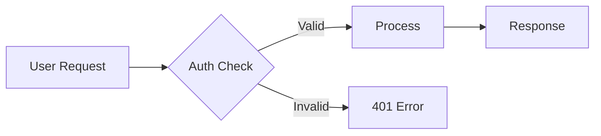
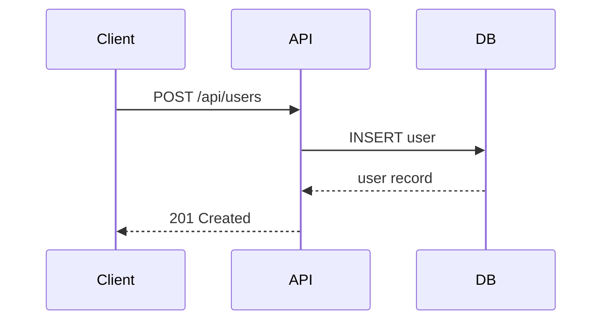

# Component Showcase

## Quick Start

This page demonstrates every registered component in the framework. Each component is rendered from a YAML code fence — no JavaScript required in your markdown.

### Card Grid

Link cards for navigation or feature highlights:

```card-grid
- title: "Users API"
  description: "Manage user accounts, roles, and permissions."
  icon: "👤"
  href: "#/"
- title: "Products API"
  description: "Product catalog, inventory, and pricing."
  icon: "📦"
  href: "#/"
- title: "Analytics"
  description: "Usage metrics, dashboards, and reporting."
  icon: "📊"
  href: "#/"
```

### Entity Schema

Document data models with expandable field details:

```entity-schema
name: "User"
parent: "BaseEntity"
fields:
  - name: "email"
    type: "string"
    required: true
    description: "Primary email address. Must be unique across the system."
  - name: "role"
    type: "enum"
    required: true
    description: "Authorization level for the user."
    values: ["admin", "editor", "viewer"]
  - name: "lastLogin"
    type: "datetime"
    description: "Timestamp of the most recent successful authentication."
  - name: "metadata"
    type: "object"
    description: "Arbitrary key-value pairs for extensibility."
```

### API Endpoint

Document REST endpoints with method badges and collapsible details:

```api-endpoint
method: "POST"
path: "/api/v1/users"
description: "Create a new user account"
params:
  - name: "email"
    type: "string"
    required: true
  - name: "role"
    type: "string"
    required: false
  - name: "name"
    type: "string"
    required: true
response: |
  {
    "id": "usr_abc123",
    "email": "user@example.com",
    "role": "viewer",
    "createdAt": "2025-01-15T10:30:00Z"
  }
```

```api-endpoint
method: "GET"
path: "/api/v1/users/:id"
description: "Retrieve a user by ID"
params:
  - name: "id"
    type: "string"
    required: true
response: |
  {
    "id": "usr_abc123",
    "email": "user@example.com",
    "role": "viewer"
  }
```

```api-endpoint
method: "DELETE"
path: "/api/v1/users/:id"
description: "Delete a user account"
params:
  - name: "id"
    type: "string"
    required: true
```

### Status Flow

Visualize state machines — click states to see transitions and side effects:

```status-flow
states:
  - id: "draft"
    label: "Draft"
    trigger: "User creates a new record"
    next: ["pending"]
    effects: ["Validate required fields"]
  - id: "pending"
    label: "Pending Review"
    trigger: "User submits for review"
    next: ["approved", "rejected"]
    effects: ["Notify reviewers", "Lock editing"]
  - id: "approved"
    label: "Approved"
    trigger: "Reviewer approves"
    next: ["published"]
    effects: ["Notify author", "Unlock publishing"]
  - id: "rejected"
    label: "Rejected"
    trigger: "Reviewer rejects"
    next: ["draft"]
    effects: ["Notify author with feedback"]
  - id: "published"
    label: "Published"
    trigger: "Author publishes"
    effects: ["Make publicly visible", "Index for search"]
```

### Mermaid Diagram

Standard mermaid fences work out of the box:



## Technical Reference

### Directive Table

Searchable, categorized reference tables:

```directive-table
title: "Configuration Options"
searchable: true
categories:
  - name: "Display"
    directives:
      - name: "ui:widget"
        type: "string"
        description: "Override the default widget for a field"
        example: '"ui:widget": "textarea"'
        details: "Supported widgets: text, textarea, select, checkbox, radio, date, file, hidden, color"
      - name: "ui:placeholder"
        type: "string"
        description: "Placeholder text shown in empty fields"
        example: '"ui:placeholder": "Enter your name..."'
      - name: "ui:disabled"
        type: "boolean"
        default: "false"
        description: "Disable user interaction with this field"
  - name: "Layout"
    directives:
      - name: "ui:order"
        type: "array"
        description: "Control the order of fields in a form"
        example: '"ui:order": ["name", "email", "role"]'
      - name: "ui:columns"
        type: "number"
        default: "1"
        description: "Number of columns for the form layout"
      - name: "ui:className"
        type: "string"
        description: "CSS class to apply to the field wrapper"
  - name: "Validation"
    directives:
      - name: "ui:help"
        type: "string"
        description: "Help text displayed below the field"
      - name: "ui:errorMessages"
        type: "object"
        description: "Custom error messages per validation rule"
        example: |
          "ui:errorMessages": {
            "required": "This field cannot be empty",
            "minLength": "Must be at least 3 characters"
          }
```

### Step Type

Document workflow step types with sync/async badges:

```step-type
name: "SendNotification"
category: "async"
description: "Sends a notification to one or more recipients via the configured channel (email, SMS, push). Executes asynchronously and does not block workflow progression."
properties:
  - name: "channel"
    type: "enum"
    required: true
    description: "Delivery channel: email, sms, or push"
  - name: "recipients"
    type: "array"
    required: true
    description: "List of recipient identifiers"
  - name: "template"
    type: "string"
    required: true
    description: "Notification template ID"
  - name: "retryCount"
    type: "number"
    description: "Number of retry attempts on failure"
example: |
  {
    "type": "SendNotification",
    "channel": "email",
    "recipients": ["${entity.assignee}"],
    "template": "review-requested",
    "retryCount": 3
  }
```

```step-type
name: "ValidateFields"
category: "sync"
description: "Validates entity fields against a schema before allowing the workflow to proceed. Blocks execution if validation fails."
properties:
  - name: "schema"
    type: "string"
    required: true
    description: "Schema ID to validate against"
  - name: "strict"
    type: "boolean"
    description: "If true, fail on any extra fields not in schema"
example: |
  {
    "type": "ValidateFields",
    "schema": "user-profile-v2",
    "strict": true
  }
```

### Config Example

Annotated code blocks with numbered callouts:

```config-example
title: "Application Configuration"
language: "json"
code: |
  {
    "app": {
      "name": "My Service",
      "port": 3000,
      "env": "production"
    },
    "database": {
      "host": "db.example.com",
      "pool": { "min": 5, "max": 20 }
    },
    "cache": {
      "ttl": 3600,
      "driver": "redis"
    }
  }
annotations:
  - line: 4
    text: "Port must be between 1024 and 65535. Defaults to 3000 in development."
  - line: 8
    text: "Connection pool settings. Adjust based on expected concurrent load."
  - line: 11
    text: "Cache TTL in seconds. Set to 0 to disable caching."
```

### Side by Side

Two-panel comparison layout:

```side-by-side
left:
  title: "Before"
  content: "Old code here"
right:
  title: "After"
  content: "New code here"
```

### Mermaid — Sequence Diagram


