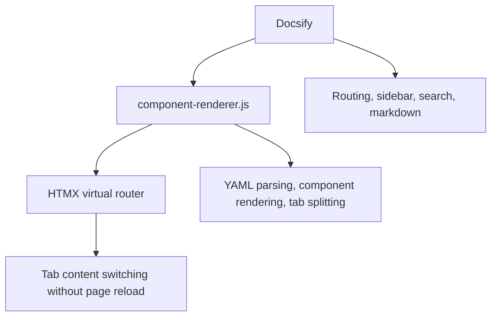
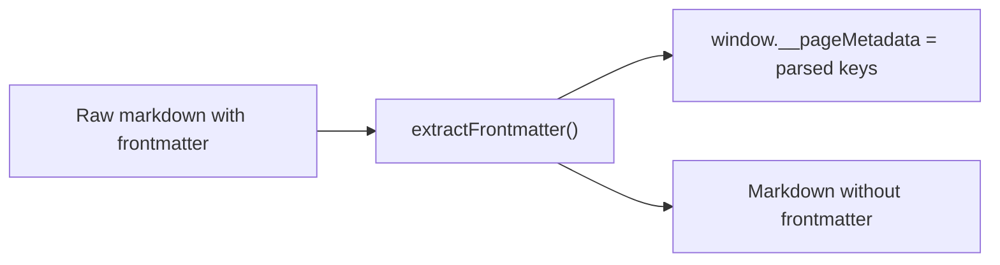
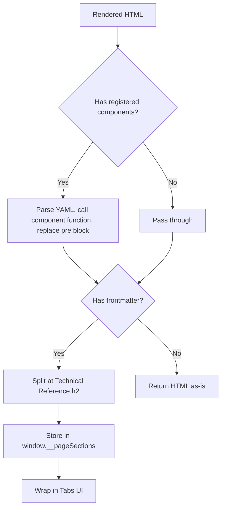
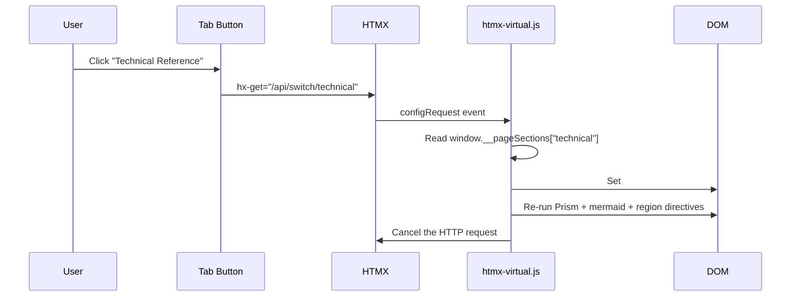

# Architecture

## Quick Start

DocsifyTemplate has three layers. Understanding how they connect helps you debug issues and extend the framework.

### The Short Version

1. **Docsify** handles everything a docs site needs: routing, sidebar, search, markdown rendering. You write `.md` files, Docsify turns them into pages.

2. **component-renderer.js** is a Docsify plugin that hooks into the rendering pipeline. It does three things:
   - Strips YAML frontmatter before Docsify sees it
   - Replaces code fence components with rendered HTML
   - Splits pages into Quick Start / Technical Reference tabs

3. **htmx-virtual.js** handles tab switching. When you click a tab, HTMX intercepts a fake HTTP request and swaps content from memory — no server, no page reload.

For more on [Docsify](https://docsify.js.org/) and [HTMX](https://htmx.org/), see their official docs.

## Technical Reference

### Plugin Lifecycle

`component-renderer.js` uses three Docsify hooks that run in order for every page navigation:

#### 1. beforeEach(content)

**Runs on:** Raw markdown string (before Docsify renders it)

**Does:**
- Detects YAML frontmatter (`---` delimiters at the top)
- Parses frontmatter into key-value pairs
- Stores metadata in `window.__pageMetadata`
- Returns markdown with frontmatter stripped

**Frontmatter parser limitations:** Uses a simple regex parser, not js-yaml. Handles `key: value` and `key: [a, b]` but not nested objects. See [Getting Started](/content/guide/getting-started) for details.

#### 2. afterEach(html)

**Runs on:** Rendered HTML string (after Docsify converts markdown to HTML)

**Does two things:**

**A. Code fence component rendering:**
- Regex scans for `<code class="lang-{registered-name}">`
- Extracts text content from each match
- Parses YAML with `jsyaml.load()`
- Calls `window.ComponentName(data)`
- Replaces the `<pre>` block with returned HTML

**B. Tab splitting (requires both frontmatter AND a `## Technical Reference` heading):**
- Looks for `<h2>` containing "Technical Reference"
- Splits HTML at that point into two sections
- Stores both in `window.__pageSections`
- Wraps content in tab UI using `window.Tabs()`
- Shows Quick Start tab by default
- If frontmatter exists but the heading is missing, all content stays in a single tab

#### 3. doneEach()

**Runs on:** Nothing (DOM is already updated)

**Does post-render cleanup:**
- `Prism.highlightAll()` — syntax highlighting for code blocks
- Converts mermaid code fences to `
` containers and runs `mermaid.run()`
- `processRegionDirectives()` — processes `data-region` directives
- `htmx.process()` — initializes HTMX on new DOM content

### HTMX Virtual Routing

The tab system uses HTMX to swap content without page reloads. But the routes are fake — there's no server behind them.

#### How It Works

**`htmx-virtual.js`** (~30 lines) listens to the `htmx:configRequest` event, which fires before HTMX makes any HTTP request.

The interceptor:
1. Checks if the request URL matches `/api/switch/*`
2. Extracts the view type from the URL (e.g., `technical` from `/api/switch/technical`)
3. Reads the pre-stored HTML from `window.__pageSections[viewType]`
4. Sets the target element's `innerHTML` directly
5. Re-runs post-render hooks (syntax highlighting, mermaid, region directives)
6. Cancels the HTMX request so no HTTP call is made

### Data Flow Summary

```mermaid
graph TB
    subgraph "Page Load"
        A["User navigates to /#/some-page"] --> B["Docsify fetches some-page.md"]
        B --> C["beforeEach: strip frontmatter"]
        C --> D["Docsify: markdown → HTML"]
        D --> E["afterEach: render components + split tabs"]
        E --> F["DOM updated"]
        F --> G["doneEach: Prism + mermaid + HTMX + regions"]
    end

    subgraph "Tab Switch"
        H["User clicks tab"] --> I["HTMX fires request"]
        I --> J["htmx-virtual.js intercepts"]
        J --> K["Read from window.__pageSections"]
        K --> L["Swap #tab-content innerHTML"]
        L --> M["Re-run Prism + mermaid + regions"]
    end
```

### Key Global Variables

| Variable | Set by | Used by | Purpose |
|---|---|---|---|
| `window.__pageMetadata` | `beforeEach` | Your code (if needed) | Parsed frontmatter key-value pairs |
| `window.__pageSections` | `afterEach` | `htmx-virtual.js` | Stored HTML for each tab section |
| `window.$docsify` | `index.html` | Docsify core | Docsify configuration |

### Adding a New Prism Language

See [How to add a Prism language](/content/howto/add-prism-language).
