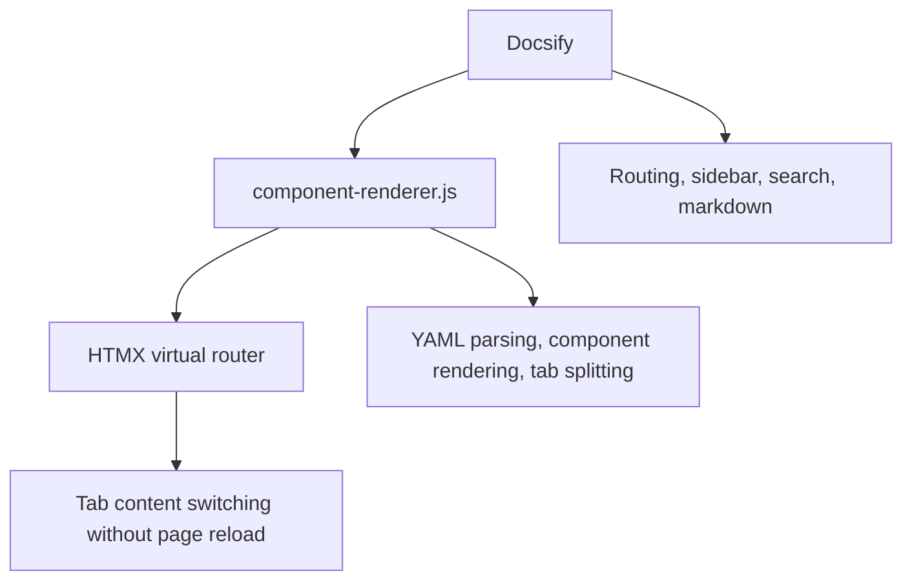

# Architecture

DocsifyTemplate has three layers. Understanding how they connect helps you debug issues and extend the framework.

### Docsify: the foundation

Docsify handles the core features a docs site needs: routing, sidebar, search, markdown rendering. You write `.md` files, Docsify turns them into pages. There is no build step — Docsify reads markdown at runtime and renders it in the browser.

This matters because it means the entire framework runs client-side. There is no server, no static site generator, no compilation. The tradeoff is that initial page loads fetch and render markdown on the fly, but the benefit is zero configuration and instant feedback while authoring.

### component-renderer.js: the bridge

`component-renderer.js` is a Docsify plugin that hooks into the rendering pipeline. It does three things:

- **Strips YAML frontmatter** before Docsify processes it (Docsify has no native frontmatter support)
- **Replaces code fence components** with rendered HTML (this is what makes YAML-to-HTML work)
- **Splits pages into tabs** when frontmatter marks a page as a guide

The design decision here is that components are just functions. Each component is a global function that takes a data object and returns an HTML string. There is no virtual DOM, no reactivity, no lifecycle — just string templates. This keeps components simple enough that anyone who knows HTML can write one.

The rendering logic is split into two files: `component-renderer-engine.js` holds pure transformation functions, and `component-renderer.js` is a thin wrapper that wires them into Docsify's hook system. This separation exists so the engine can be tested independently of Docsify. See [Engine vs hooks separation](/home/.claude/projects/-storage-emulated-0-Documents-Code-DocsifyTemplate/memory/architecture/engine-vs-hooks-separation.md) for the full rationale.

### htmx-virtual.js: the trick

The tab system uses HTMX to swap content, but there is no server. When you click a tab, HTMX initiates an HTTP request to a URL like `/api/switch/technical`. Before the request fires, `htmx-virtual.js` intercepts it, reads pre-stored HTML from memory, swaps the DOM directly, and cancels the request.

This is roughly 30 lines of code. The alternative would have been a custom tab component with its own event handling, state management, and DOM manipulation. By reusing HTMX's declarative model (`hx-get`, `hx-target`, `hx-swap`), the tab buttons are plain HTML attributes — no JavaScript event listeners in the component code.

HTMX is ~14KB gzipped for what amounts to one feature. But the virtual routing pattern it enables is reusable — any future interactive feature can work the same way.

### Why these three and not fewer?

Docsify alone gives you a docs site. The component renderer adds data-driven pages on top. HTMX adds interactivity without writing custom JavaScript. Remove any layer and the others still work — a page without components is just markdown, a page without tabs still renders all its content. That independence is intentional.

For technical details on hooks, routing, variables, and dependencies, see [Framework Reference](/content/guide/framework-reference).
