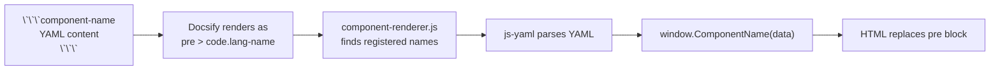

# Getting Started

## Quick Start

DocsifyTemplate is a zero-build-step documentation framework built on [Docsify](https://docsify.js.org/). You write markdown, optionally drop in YAML code fences, and get interactive docs with search, tabs, diagrams, and data-driven components.

> **Heads up:** This framework was vibe coded. It works, it's in production, but rough edges exist. Contributions and improvements are welcome.

### What You Get

```card-grid
- title: "YAML-Powered Components"
  description: "Write YAML in code fences — get interactive HTML. No JavaScript needed in your markdown files."
  icon: "< />"
  href: "#/content/guide/components-reference"
- title: "Quick Start / Technical Tabs"
  description: "Split any page into audience-appropriate tabs with a single frontmatter flag."
  icon: "||"
  href: "#/content/guide/architecture"
- title: "Zero Build Step"
  description: "No webpack, no Vite, no npm build. Edit markdown, refresh browser, done."
  icon: "0"
  href: "#/content/guide/getting-started"
```

### Install and Run

```bash
# Clone the repo
git clone <your-repo-url> my-docs
cd my-docs

# Install docsify-cli (the only dependency)
npm install

# Start the dev server
npm run serve
# → http://localhost:3000
```

### Write Your First Page

**1. Create a markdown file** under `docs/`. The file path becomes the URL:

| File path | URL | Sidebar link |
|---|---|---|
| `docs/my-page.md` | `/#/my-page` | `/my-page` |
| `docs/content/guide/foo.md` | `/#/content/guide/foo` | `/content/guide/foo` |

```markdown
# My Page

This is a regular markdown page. It just works.
```

**2. Add it to the sidebar** in `docs/_sidebar.md`:

```markdown
* [Home](/)
* [My Page](/my-page)
```

**3. Refresh the browser.** That's it — no build, no restart.

### Add Your First Component

Components are just YAML inside a code fence. Use a registered component name as the language:

````markdown
```card-grid
- title: "First Card"
  description: "This renders as an interactive card grid."
  icon: "1"
  href: "#/"
```
````

That YAML becomes a styled, clickable card grid. See the [Component Showcase](/content/examples/component-showcase) for live examples of every component, or the [Components Reference](/content/guide/components-reference) for the full API.

### Add a Tabbed Page

Want to split content for different audiences? You need **both** frontmatter and the two specific headings:

````markdown
---
type: guide
category: example
tags: [demo]
---

# My Tabbed Page

## Quick Start

Simple explanation here...

## Technical Reference

Deep technical details here...
````

The framework generates tab buttons and handles switching via HTMX — no page reload.

**Both are required:** Frontmatter triggers the tab-splitting logic, and the `## Technical Reference` heading is where the split happens. Without frontmatter, no tabs. Without the heading, all content stays in one tab.

### Next Steps

- [Components Reference](/content/guide/components-reference) — full API for all 10 components
- [Creating Components](/content/guide/creating-components) — build your own
- [Architecture](/content/guide/architecture) — how the pipeline and virtual routing work under the hood

## Technical Reference

### Project Structure

```
docs/
├── index.html              # Entry point — CDN deps, component loading, Docsify config
├── _sidebar.md             # Sidebar navigation
├── README.md               # Home page (this is what "/" renders)
├── components/             # Component JS files (template literal functions)
│   ├── api-endpoint.js
│   ├── card-grid.js
│   ├── code-block.js
│   ├── config-example.js
│   ├── directive-table.js
│   ├── entity-schema.js
│   ├── region-toggle.js
│   ├── status-flow.js
│   ├── step-type.js
│   └── tabs.js
├── plugins/
│   ├── component-renderer.js   # Core Docsify plugin — YAML parsing + component rendering
│   └── htmx-virtual.js         # Tab switching interceptor (~30 lines)
├── styles/
│   └── theme.css               # Docsify overrides + brand colors
└── content/                    # Your documentation pages
    ├── guide/
    └── examples/
```

### Component Registration

Components must be registered in **two places**:

**1. `docs/index.html`** — add a `<script>` tag in the component section (after the existing component scripts, before `window.$docsify`):

```html
<script src="components/my-component.js"></script>
```

**2. `docs/plugins/component-renderer.js`** — add the kebab-case name to the `COMPONENT_REGISTRY` array:

```javascript
const COMPONENT_REGISTRY = [
  'entity-schema', 'api-endpoint', 'status-flow',
  'directive-table', 'step-type', 'config-example',
  'card-grid', 'my-component'  // ← add here
];
```

The renderer converts the kebab-case name to PascalCase and calls `window.MyComponent(data)` with the parsed YAML.

### How the Pipeline Works



### CDN Dependencies

| Dependency | Version | Purpose |
|---|---|---|
| Docsify | 4.x | Routing, sidebar, search, markdown rendering |
| HTMX | 2.0.3 | Tab content switching (virtual routes only) |
| Tailwind CSS | v4 (browser) | Component styling — no build step |
| Prism.js | 1.x | Syntax highlighting (JS, JSON, YAML, Bash, C#, Markdown) |
| Mermaid | 10.9 | Diagrams (flowcharts, sequence, etc.) |
| js-yaml | 4.x | YAML parsing for code fence components |

Everything loads from CDN. No `node_modules` are shipped to the browser — `npm install` is only for `docsify-cli` (the dev server).

### Brand Colors

Primary color is set in two places:

**`docs/index.html`** (Tailwind theme):
```html
<style type="text/tailwindcss">
  @theme {
    --color-primary: #0891b2;
    --color-brand: #95c22f;
  }
</style>
```

**`docs/styles/theme.css`** (Docsify overrides):
```css
:root {
  --theme-color: #0891b2;
}
```

Change both to match your brand.

### Frontmatter Limitations

The frontmatter parser in `component-renderer.js` uses a simple regex-based parser instead of js-yaml. It handles:

- Simple key-value pairs: `type: guide`
- Arrays: `tags: [tag1, tag2]`

It does **not** handle nested objects, multiline values, or complex YAML features. This only affects frontmatter — code fence components use the full js-yaml parser and support the complete YAML spec.

> Switching frontmatter parsing to js-yaml would remove these limitations. PRs welcome.
